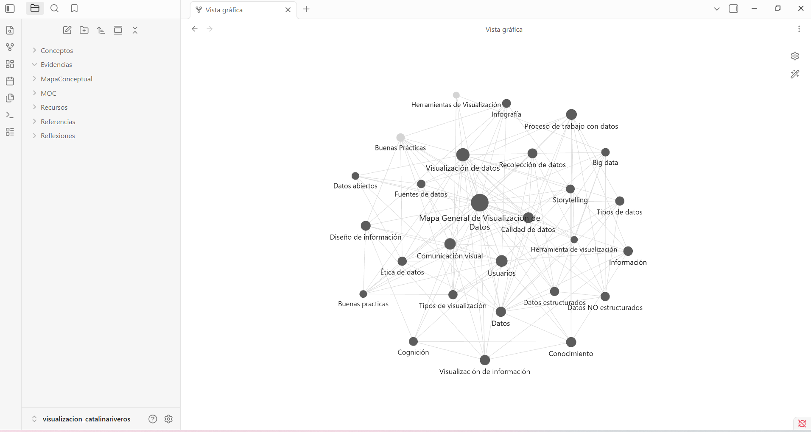

# Visualización de Datos – Unidad 1

## Datos del estudiante

**Nombre:** Catalina Riveros  
**Carrera:** Ingeniería en Informática  
**Asignatura:** Visualización de Datos  
**Profesor:** Javier Miles  
**Fecha:** 28 de septiembre de 2026  

## Descripción del proyecto

Este repositorio corresponde a la Evaluación Sumativa de la Unidad 1: Conceptos Fundamentales de Visualización de Datos.

El objetivo del proyecto es construir una base de conocimiento relacionada con la visualización de datos, utilizando Obsidian para organizar y relacionar conceptos fundamentales y GitHub para respaldar el trabajo y mantener un historial de versiones.

El proyecto aborda conceptos como datos, información, conocimiento, calidad de datos, tipos de datos, comunicación visual, storytelling, usuarios, herramientas de visualización y buenas prácticas.

Además, se desarrolló un mapa conceptual integrador y se realizó un análisis crítico de tres visualizaciones reales provenientes del INE, Banco Central de Chile y Banco Mundial.

## Estructura del proyecto

- **MOC:** contiene el Mapa General de Visualización de Datos.
- **Conceptos:** contiene las notas conceptuales desarrolladas en Obsidian.
- **Referencias:** contiene las fuentes utilizadas durante el desarrollo del trabajo.
- **Reflexiones:** contiene reflexiones relacionadas con el aprendizaje de la unidad.
- **MapaConceptual:** contiene el mapa conceptual integrador sobre Visualización de la Información.
- **Evidencias:** contiene la captura de la Vista gráfica de Obsidian y el historial de commits.
- **Recursos:** contiene las visualizaciones reales utilizadas para el análisis crítico.
- **Informe:** contiene el informe final de la evaluación.

## Vista gráfica de Obsidian

La Vista gráfica permite observar las relaciones existentes entre los conceptos desarrollados durante la unidad. La estructura muestra que la visualización de datos se relaciona con la calidad de los datos, comunicación visual, usuarios, herramientas, buenas prácticas y otros conceptos fundamentales.

## Aprendizaje

El desarrollo de esta actividad me permitió comprender que la visualización de datos no consiste solamente en crear gráficos, sino en transformar datos en información que pueda ser comprendida y utilizada para generar conocimiento.

Obsidian me permitió organizar los conceptos como una red interconectada y comprender mejor las relaciones existentes entre ellos. Por otra parte, GitHub permitió mantener un registro de los avances realizados mediante commits, facilitando la trazabilidad y el control de versiones.

Finalmente, el análisis de visualizaciones reales me permitió reconocer la importancia de seleccionar correctamente los tipos de gráficos, considerar las características de los usuarios y aplicar buenas prácticas para comunicar información de manera clara y comprensible.
